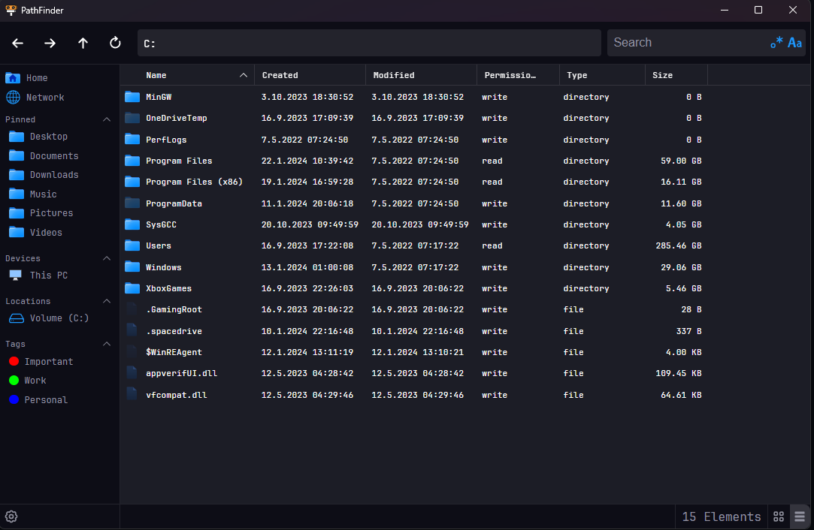

# PathFinder

A fast FileExplorer written in Rust and Svelte



## Running

1. Clone this repository 
```bash
git clone https://github.com/Profiidev/PathFinder && cd PathFinder
```

2. Install all required npm packages
```bash
npm i
```

3. Run the dev app
```bash
# run the dev app
npm run tauri dev
```
    or
```bash
# build the project
# the .exe will be in src-tauri/target/release and the msi installer in src-tauri/target/release/bundle/msi
npm run tauri build
```
